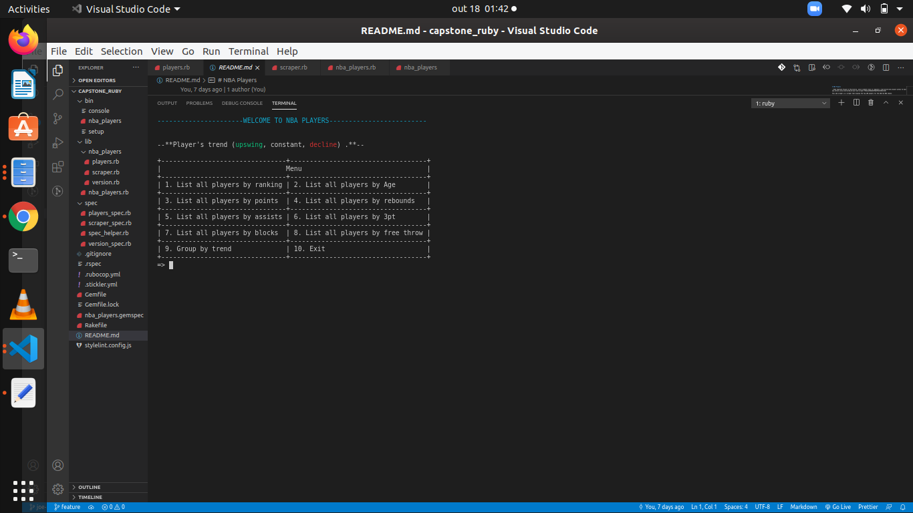
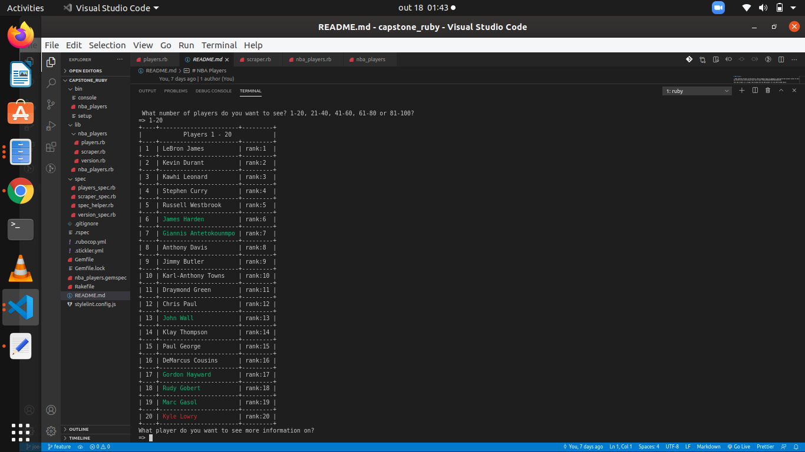
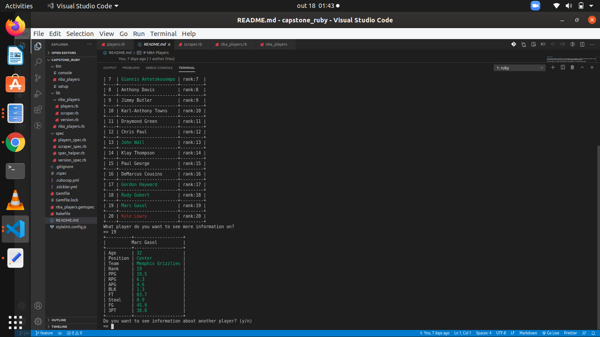

# NBA Players

> This project is a ruby capstone project from the [Microverse](https://www.microverse.org/) technical curriculum, which students have to complete a real-world-like project within 72 hours according to [this project specifications](https://www.notion.so/microverse/Build-your-own-scraper-f54eaca54d8a4d758a5f0141468127a8)

This web scraper is a scraper that display The Top 100 players for the 2017-18 NBA season.

## Video Presentation

Feel free to check out this [link](https://www.loom.com/share/4739adb7e5034fdd93fc4974bde8f7e9) for a video walkthrough :)

## Contents

- [Description](#description)

- [Built With](#built-with)

- [Project Structure](#project-structure)

- [How to deploy this scraper](#deployment)

- [How to use this Web scraper](#how-to-use-this-web-scraper)

- [Contributions](#contributing)

- [Authors](#author)

## Description

**Web scraping**, also known as **web data extraction**, is the process of retrieving or “scraping” data from a website. Web scraping uses intelligent automation to retrieve hundreds, millions of data points from the internet’s seemingly endless frontier. [Read more at scrapinghub...](https://www.scrapinghub.com/what-is-web-scraping/)

**This project demonstrates an example of Web scraping by retrieving data from the [Top 100 | NBA Players](https://www.washingtonpost.com/graphics/2017/sports/nba-top-100-players-2017/?noredirect=on&utm_term=.adcc13ae7e38) webpage and presenting it to the user.**

The Scraper presents retrieved data to the user in 3 phases all of which depend on their selection or response :

- **Phase 1** : A list of players option
- **Phase 2** : A list of players from a particular option
- **Phase 3** : Information about **A PLAYER** from the list of players in **Phase 2**

| OPTIONS           |
| ----------------- |
|  |

| PLAYERS LIST      |
| ----------------- |
|  |

| PLAYER INFORMATION |
| ------------------ |
|   |

## Built With

- Ruby
- Nokogiri gem
- Colorize

## Project Structure

```
├── bin
    └── console
    └── nba_players
    └── setup
└── lib
    └── nba_players.rb
    └── players.rb
    └── scraper.rb
    └── version.rb
└── spec
    └── cli_spec.rb
    └── players_spec.rb
    └── scraper_spec.rb
    └── spec_helper.rb
    └── version_spec.rb
├── README.md
```

## Deployment

1. Git clone this repo and cd the to the `capstone_ruby` directory.
2. Run `bundle install` in command line to install Nokogiri and colorize.
3. Run the following command to deploy the scraper

```bash
    ruby bin/nba_players
```

## Run tests

1. Git clone this repo and cd the to the `capstone_ruby` directory.
2. Install rspec with `gem install rspec`.
3. Run `rspec` in Command Line.
4. `9 examples, 0 failures` will be shown on the screen.

## How to use this Web Scraper

1. When the scraper is opened, it displays a brief description of information and then asks you to choose from different options.

2. After choosing, the Scraper will ask What number of players do you want to see? 1-20, 21-40, 41-60, 61-80 or 81-100?

3. After choosing, it will display a list of players.

4. At this point, below the list, the Scraper will ask you What player do you want to see more information on?

5. When you enter a valid number, the scraper will display a list of informations about the player

6. Again, at this point, the Scraper will ask you if you want to see information about another player? (y/n)

7. If yes it will go back to step 4, but if no back to step 3 and if it still no you will exit the process.

## What it does?

- [x] Have a CLI for interfacing with the application
- [x] Pull data from an external source
- [x] Implement both list and detail views

## Author

👤 **Josue Abraham**

- Github: [@joecleverman](https://github.com/joecleverman)
- Linkedin: [Josue Abraham](https://www.linkedin.com/in/josueabraham/)

## 🤝 Contributing

Contributions, issues and feature requests are welcome!

Feel free to check the [issues page](https://github.com/joecleverman/capstone_ruby/issues?q=is%3Aissue+is%3Aopen+sort%3Aupdated-desc).

## Show your support

Give a ⭐️ if you like this project!

## Acknowledgments

- Microverse
- Nokogiri gem
